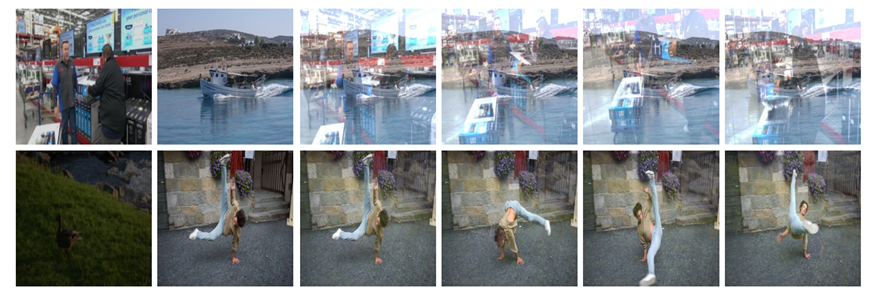

# 2D_video_reflection_removal
2D video reflection removal 

Dataset was synthetically made using DAVIS 2016, 2017 
Transmission and reflection images were mixed following the paper "Single Image Reflection Removal Using Non-Linearly Synthesized Glass Images and Semantic Context"

Dataset used : DAVIS 2016, 2017  https://davischallenge.org/
3D convolution from https://github.com/sabarim/3DC-Seg 

Pytorch  1.5.1  
Cuda : 10.2  

